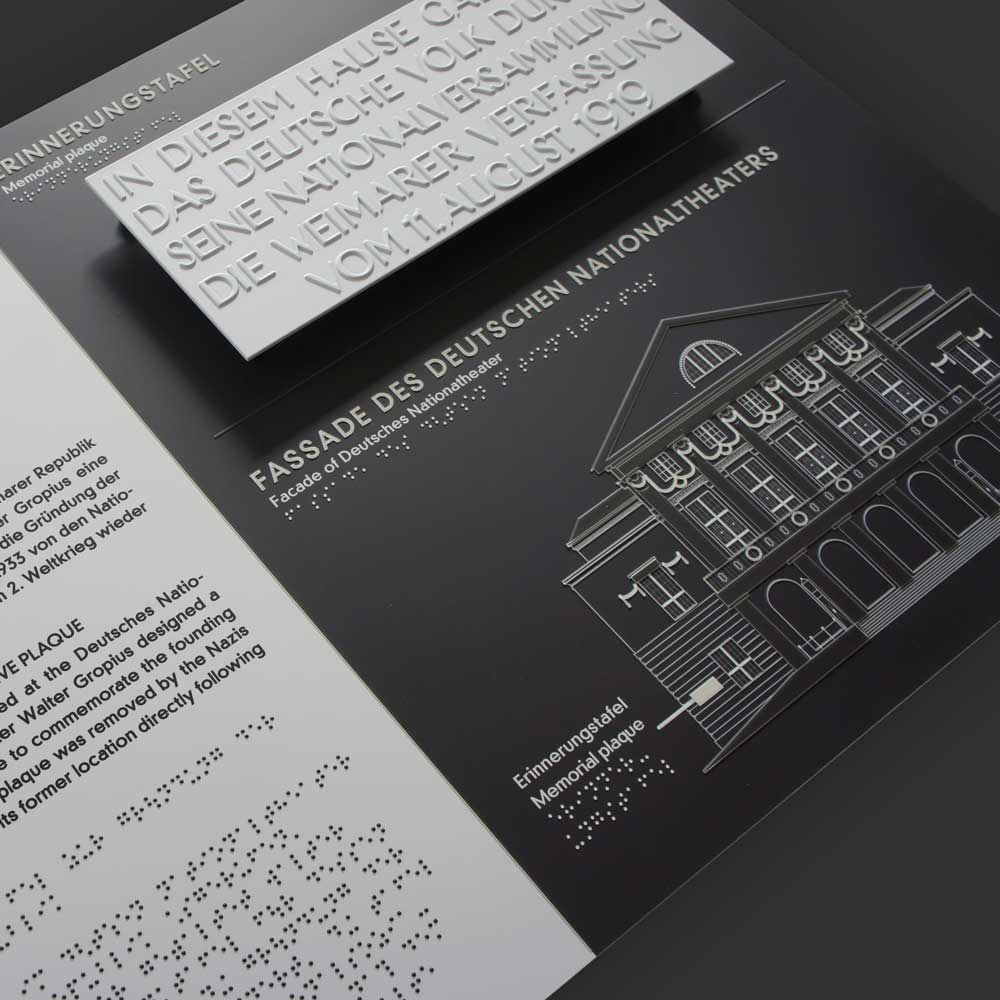
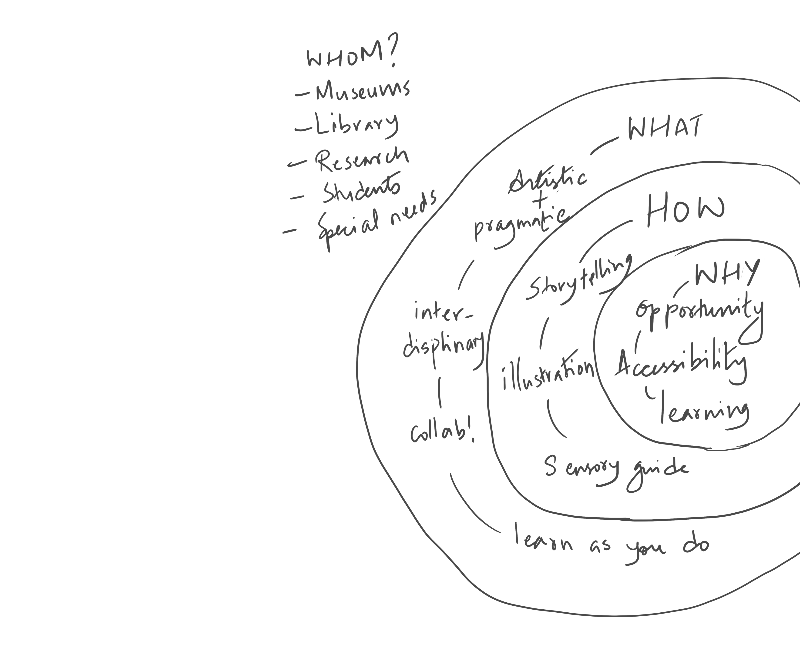
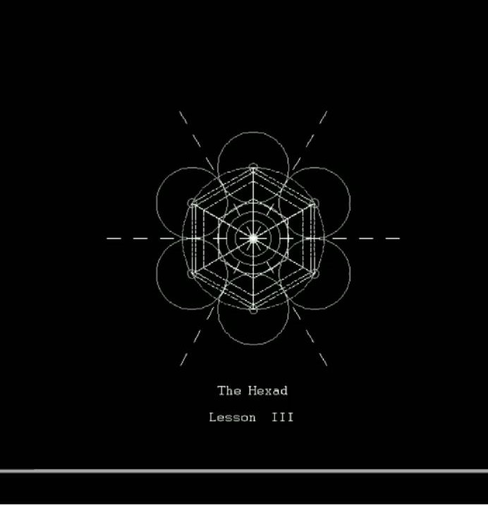

# An-illustrative-journey-of-snow

<h3><b>Bringing and immersive learning experience in natural sciences for non-experts</b></h3> 

<li><a href="#abstract">0.0. Abstract</a></li>
<li><a href="#intro">1.0. Introduction: An illustrative journey of snow</a></li>
<li><a href="#aim">2.0. Aim: Creating an immersive experience</a></li>
<li><a href="#snowflakes_science">3.0. What exists in the field? Snowflakes and science</a></li>
<li><a href="#conception">4.0. Conception: A human and object experience</a></li>
<ul>
<li><a href="#syntonicLearning">4.1. Syntonic learning: For meaningful and creative learning</a></li>
<li><a href="#visScience">4.2. Visual science: Study of snow crystals into diagrams</a></li>
<li><a href="#storytelling">4.3. Storytelling: Key elements of expert storytellers</a></li>
<li><a href="#tactile">4.4. Tactile graphics: Inclusive design in objects</a></li>
<li><a href="#methods">4.5. Method: Design thinking approach</a></li>
<li><a href="#workshop">4.6. Workshop: Creatind ideas from experience</a></li>
<li><a href="#cc">4.7. Creating coding: Fabricate nature with code</a></li>
</ul>
<li><a href="#designProcess">5.0. Design process: What, how, why and for whom?</a></li>
<ul>
<li><a href="#pp">5.1. Paper prototype: Initial design concept</a></li>
<li><a href="#sketchTactile">5.2. Storytelling: Story sketch for tactlile graphics</a></li>
<li><a href="#structure">5.3. Installation: Woodworking of the physical structure</a></li>
<li><a href="#snowcrystals">5.4. Tactile graphics: Crafted stages of snowflakes</a></li>
<li><a href="#interact">5.5. Interaction: Response with user interaction</a></li>
</ul>
<ul>
<li><a href="#findings">6.0. Major findings: Engaging sensory experience</a></li>
<li><a href="#implications">7.0.Implications</a></li>
<li><a href="#conclusion">8.0. Conclusion: Making a friendly learning space</a></li>
<li><a href="#outlook">9.0. Outlook: Experimental learning design</a></li>
<li><a href="#reference">10.0. References</a></li>
</ul>

<h1 id="abstract">0.0 Abstract</h1>

Textbooks and museums are filled with enormous amounts of information.
Readers and visitors to the museums without rudimentary knowledge about
the subject or object may fail to understand and appreciate the vast array of
information offered. There is a common misconception that natural sciences
are vast and complex for beginners and especially for readers or learners
with learning disabilities. However, I believe that science can be made easy
to understand and interesting if it is made fun and interactive. The structure
of a snowflake is one good example from natural sciences that can be used
to demonstrate the importance of interactive storytelling design to enhance
and shift to a more engaging learning experience for users. There is rich
visual content in natural sciences to talk about different snowflake shapes.
The subject has been explored extensively by scientists, crystallographers,
documentary makers and photographers. 
My project idea stems from data visualization, inclusive design, illustration,
and my keen interest in recreating natural shapes with codes. The subject
revolves around applying interactive storytelling to bring natural sciences for
an immersive learning experience for users. The project agenda is to weave
illustrations and natural sciences together where the process of making a
visual design artifact focuses on inclusive (users with or without disabilities)
and interactive design. The theme will also explore the importance of using the
tactile design so that users can interact with the artifact for a better learning
experience rather than just looking at it or reading it. A prototypical installation
will demonstrate the interactive storytelling for my final presentation.

<h1 id="intro">1.0 Introduction: An illustrative journey of snow</h1>

Snowflake begins its journey from among the clouds as an ice crystal. The temperature
should be exactly right, about -0 degree Celsius. Too cold and there won’t be enough water in the
cloud to form the crystal that would slowly morph into a snowflake as it travels down to
earth. That’s not all, there has to be minute debris like dust particles and pollen grain in
the atmosphere for the water droplet to attach itself to to begin the transformation.
It has been studied and documented by illustrators, photographers, enthusiasts and
scientists. These fascinating natural occurrences have made it through modern scientifi c
studies for it’s patterns, the physics behind it and its effect on climate. Even for a layman,
snowflakes are an intriguing experience to witness. 
My thesis project is to deconstruct the many shapes of snowflakes into interactive visual
storytelling in the field of natural sciences. My study delves into the natural design of
snow crystals that is influenced by temperature and humidity. This concept is to show the
amazing, nature made snow crystal design and introduce it into our immersive learning
space and institute for a better understanding of how snowflakes shapes are the way they
are. I want to make natural science approachable and interesting for children, laymen,
and for visually impaired individuals by creating a friendly learning and exploratory
space for them. I want to touch the ideology of syntonic learning where the user and the
object interact with each other whilst the user feels that they are able to control, help or
manipulate a part of the growing process. 
Natural sciences are deemed too complex and vast for a layman. This can be quite
intimidating. There is much scientific and artistic research done extensively about
snowflakes but they are not exclusively available and accessible for my target groups.
Museums and educational spaces have a lot of topics that cover natural sciences
in general but I beg the question of how much each individual is able to absorb the
information laid out for them either as text, on screens, or as an artifact. Also is it inclusive
enough for a visually impaired individual to participate and experience too? There exist
experimentation with immersive learning already but there still lays a gap of bringing my
target groups into consideration. 
Immersive learning activates when we switch our senses on while we explore and absorb
information from the external environment. The many shapes of snowflakes, especially its
form and structures are what makes them a gem for a visual and educational experience.
 
Using illustrations has been one of our primordial tools for learning things we
see around us. We can name, define shapes and remember what we experience
vividly with the help of their visual interpretation. Illustration has not only
remained a flat drawn object on a rock but is sculpted or etched on objects to
define its meaning, placements or themes like celebration or religious symbols.
Illustration not only simplifies but stimulates the idea of our experience much
more vividly. Drawing goes back to 30,000 to 10,000 BC before men could
even begin to learn writing. In many caves of France and Spain, rudimentary
drawings made by early men documented the things they had seen, and kept
track of the cycle of seasons. The early man would observe nature, seasons, and
mark places through drawing and also draw their hunting plans for a successful
hunt. The Egyptians drew their daily lives and made blueprints of their historical
monuments. In the middle ages, illustration was meant to preach and teach
religion while the Renaissance studied nature, architecture, and physical
structure of the human body. During the Baroque period of the 1600s-1700s
humans began to use drawing to convey forms, emotions, and movement. In the
1800s and 1900s drawing became a dynamic tool to explore abstract themes.
And at present drawing has become a transcribing tool used in the digital realm
of information. <i>(History Of Drawing timeline., 2020)</i> 
Deconstructing the morphing snowflakes for my installation is just as simple
as knowing which would be more effective: reading Shakespeare or enacting a
Shakespeare play. Imagine which is more effective, when teachers make their
students read Shakespeare’s play in the classroom or make them participate as
characters, enacting his play. Many scientists and researchers have designed
snowflakes with hardcoded algorithms for science and it has yet to be explored
in the design fi eld with a focus on storytelling. So, I would like to build an
immersive storytelling installation that showcases the many shapes of snow
through visual and interactive experience. 
To bring a friendly design and environment in learning spaces, there should be
interest and creative exploration created for humans with an object that he or
she is interacting with. This is where I believe the ideology of syntonic learning
will play a vital role to develop a harmonious interaction between human and
objects. Syntonic learning is when one’s experience can be observed and
encouraged to develop a possible solution or meaning to what he or she is trying
to create or understand from an idea. He or she sees that learning by doing is
a way to have a better grasp of how things function and exists making it even
clearer for them to understand. 
So, if we ask each other to describe how snowflakes are created, the answers
are mostly defined as something to do with cold, tiny frozen water, glassy,
ice dust, or the wonders of Christmas. Even if many of our descriptions differ
from each other, we will still draw or recognize a familiar structure or shape of
snowflakes. And instead of discarding our theories or definition, we will see an
amazing fact that we all execute and generate the same ideas about snowflakes.
We did not go through physics or mathematics to define snowflakes and yet
we have defined most of the elements involved in the creation. This speaks of
syntonic learning. These fascinating facts that we have gathered with sheer
observation and curiosity shaped my interest to use the visual experience to talk
about natural sciences rather than being simply exposed to complex scholarly
content. Maybe, this is how many of us want to enrich our discussions and
knowledge with others and develop creative ways of exploring natural sciences.
The aim is to be able to hold our very own experiences with the old and new
ones without being critical of our previously held ideas and knowledge.

<h1 id="aim">2.0 Aim: Creating an immersive experience</h1>

•Creating an artifact for interactive storytelling of snow crystals.
The design concept is to bridge the gap between experts and laymen. I will
design the illustrated example of morphing snowflakes to enhance the learning
experience for users. My project will cover the aspects of inclusive design where
users with or without disabilities can participate. 
•Synthesizing the morphology of snow structures with code and making it
tangible enough for user interaction. 
The goal is to use interdisciplinary design concepts to create an illustrative
journey of snow. I want to create a digital interaction where I can study the
basics of non-linear design, test it, and learn or collaborate as a user experience
designer helping the experts in the field. 
•Visually storytelling of the growing snow crystal that the user can touch and
explore. 
My design concept is to tell you a story about where the creation of snowflakes
begins. Much like the art of telling stories: once upon a time, there was a …., I
am looking for the place where the snowflakes begin. The sketch concept is the
collected scientific content about the morphology of snowflakes. And My goal is
to bring this story to both digital and analog interaction. 
I believe when more social structures in public spaces, education, and
museums open up to systems with inclusive design, it enhances an engaging
environment for users leaving a long-lasting impression. Most importantly our
view on social disabilities or stigma about disabilities diminishes with the help
of thoughtful design. 
As a communication designer, our work focuses on finding an effective way to
inform users or viewers. It comes down to using our primordial senses: You
must have felt the wind, the texture of a wooden table, the cold sensation when
you touch a metal pole, you must have seen the different color pigments of
an object, or heard the differences of the sound of a train leaving the station
and another one entering, the smell of coffee, the warmth of a teacup in your
hands. Most importantly the knowledge of words related to senses with which
to describe our experiences. These often-overlooked experiences in our daily
lives that seem inconsequential make most of our stories richer. I am fascinated
by such experiences and as a designer, I see it as a way to enhance learning
experiences.

<h1 id="snowflakes_science">3.0 What exists in the field? Snowflakes and Science</h1>

Snowflakes have been extensively researched to understand its hexagonal
patterns and their effects on climate in the field of physics and snow science.
The studies of snow crystals go back to illustrated documentation since 150
BC as the historical record shows. (“Timeline research of, 2019). Notable
research has given other scientists and enthusiasts to refer to their findings
in their work and re-explore with current tools. The re-exploration are
lab-grown snow crystals controlled and manipulated by scientists to study
closely the many shapes the snow crystals can morph into. Though such
features are exclusively for scientific studies, it comes with many interesting
fi ndings that are also graphically presented in their research.
The work of Ukichiro Nakaya, whom many scientists widely refer to for
their research is his Nakaya diagram. He is the Japanese physicist credited
with making the fi rst artificial snowflakes in Hokkaido University. The
Nakaya diagram shows the morphology of snow crystals in each changing
temperature and humidity. He also kept much photographic documentation
that displayed each of the types of his lab-grown snow crystals. 
<figure>

<figcaption>Figure 1. Exhibition room. (Copyright(C) Nakaya Ukichiro Museum Of Snow Aand Ice, n.d)</figcaption>
</figure>
  

One of the recent studies of snow crystals is of Kenneth Libbrecht, a physicist
and a professor of Caltech University. His scientific work shows a comprehensive
discourse of the morphology and formation of snow crystals starting from
a molecular state. His personal website shows his lab-grown artificial snow
crystals documented with the picturesque format in both video and stills. He
covers scientific, photography, and customized snowflakes designs. He has
simplified his findings as guides and also tried to debunk myths and nonsense.
 
<figure>

<figcaption>Figure 2.Triangular crystals. Figure 3. Stellar dendrites (Kenneth Libbrecht, n.d).</figcaption>
</figure>
 
 
<
In general, visual studies in science are vast and complex, exclusively meant for
scientific purposes to demonstrate a more visual simulating view of the hoard
of information that the researchers have found. In the field of design for my
target group, there are only a few and are remotely demonstrated through live
experiments.

 
 

<b>Existing Museums with inclusive design and for the visually impaired
visitors.</b>  
There are well known museums incorporating inclusive design. They provide
visitors of my target group with more approachable information about their
artifacts that are displayed. Many of my fi ndings are designed by Tactile
studio that have brought inclusive design in many well known museums and
exhibitions. 
Museums like Klassik Stiftung Weimar, Germany have their rich historical
collection displayed for students, senior citizens, children and people with
disabilities. They use easy language for laymen and sign language. In their
new museum of the Weimar Bauhaus, braille and tactile mini structures are
installed in the topography room that showcase the key symbols of Bauhaus
movement. The visitors can also touch a replica of the famous “Hohe Pappeln”
house (1907) designed by the Belgian architect Henry Van de Velde. These
tactile installations are replicated in the same size of the real artifact displayed,
making it more accessible with braille reliefs for the content.

 
<figure>

<figcaption>Figure 4. Tactile model of “Hohe Pappeln” house (1907) of the Belgian architect Henry Van de Velde disolayed at Klassik Stiftung Weimar. Figure 5. tA tactile pavillion showing the Facade of Germany National Theater.
(Tactile Studio, n.d).</figcaption>
</figure>
 
 

The Louvre, Paris, reconstructed with the help of Tactile studio the many
architectural elements in detailed explanation of its history and modifi cation of
Louvre through time. There are 3D reconstructed artifacts with an accessible
pavilion that provides the visitors of the rich history that they are going to
explore.
 
<figure>

<figcaption>Figure 6. A parade helmet of King Charles VI, inscribed with his motto and his emblem – the winged stag.
Figure 7. Tactile station at the pavilion in 3D relief and braille, Pavillon de l’Horloge at the Louvre.
(Tactile Studio, n.d).</figcaption>
</figure>
 
 

There are museums especially focused on visual impaired visitors. It’s worth
noting that the design concepts incorporated here are similar to well known
museum’s inclusive design concept for interactive stimulation between humans
and the artifacts displayed by using technology, gadgets and touch systems for
better experience for these target groups. 
One of them is Museo Tiflológico in Madrid, Spain inaugurated on December 20
1992, focuses on offering blind and deaf visitors the possibility to experience
museums through touch, displays and sound. It has also become an institution
where blind workers and artists exhibit their work of art.
 

<figcaption>Figure 8. Visitors and museum staff interacting with a tactile model of a historic building.
(Madridinandout.com, n.d).</figcaption>
</figure>
 
 

Educational spaces and museums play an integral part to showcase and
exchange scientific and historical information much richer than textbooks.
There have been workshops to bring in an engaging environment of their targets
groups. I see much more possibility with experimental design concepts to bring
in inclusive concepts in these spaces. 
Taking the example of my experience in NaturkundeMuseum, Berlin, I have
noticed that they have hosted a workshop to create engaging space and one of
them specifies multi-sensory systems for digital visual displays of their artifacts.
However, for one of my target groups there is little to no facilities available to
experience objects and science in this space.
 

<figcaption>Figure 9. Illustrated workshop touch points that empahsize meeting their traget group needs. Digitization and multi-sensory access to the exhibition– NaturkundeMuseum, Berlin.
Figure 10. Outline of collecting future ideas and planning, NaturkundeMuseum, Berlin.</figcaption>
</figure>
 
 

In terms of showcasing research of morphication of snow crystals, they are
only available remotely. The Museum of Snow and Ice in Japan, which was
the laboratory of the physicist Ukichiro Nakaya who created the first artificial
snowflakes are family friendly and provide experimental demonstrations based
on Nakaya’s research that keep the visitor engaged.

 
<figure>

<figcaption>Figure 11. and Figure 12.Above shows a Murai type snow producing system at the Museum of snow and ice
where the staff creates snowflakes every morning and are displayed on the monitor. (Copyright(C) Nakaya
Ukichiro Museum Of Snow Aand Ice, n.d).</figcaption>
</figure>
 
<figure>

<figcaption>Figure 13.A shape of ice melting from inside. Copyright(C) Nakaya Ukichiro Museum Of Snow Aand Ice, n.d).</figcaption>
</figure> 
 

With the research work of the physicist K.Libbrecht, he has showcased in detail
his crafted snow crystals from his lab through videos and collection of lab grown
snow crystal photographs. His experiments are also shared with readers of
how to fossilize snowflakes and he has also put out how to anatomically create
snowflakes with paper in his website.
 
<figure>

<figcaption>Figure 14. A DIY of how to preserve snowflakes with the help of resin. (Kenneth Libbrecht, n.d).</figcaption>
</figure> 
 

In the research oriented field, the findings are exclusively meant for experts
and it can be daunting to know that such fi ndings are not accessible for larger
groups of non-experts, students, disabled individuals nor extensively portrayed
in any educational spaces or museums. 
This is just one theme of natural sciences that I am exploring. My design
concept is to make natural sciences an engaging subject for everyone and to aid
learning, especially for the non-experts.

<h1 id="conception">4.0 Conception: A human and object experience</h1>

The illustrative journey of snowflakes design is based on observation as well as
the actual process of how each snowflakes take many forms in scientific point of
view. The design process explores the ideology of syntonic learning.
The idea of syntonic learning started with Seymour Papert, a mathematician,
computer scientist, educator and co-inventor of Logo programming language.
He observed children use Logo to draw a circle by programming the turtle
to trace a circle on the screen and noted that the children were perceiving
themselves as the turtle on the screen to predict the moves and actions to draw
the circle.
 
<figure>

<figcaption>figure1.Brain dumps</figcaption></figure>

<h1 id="syntonicLearning">4.1 Syntonic learning for meaningful and creative learning</h1>

The word syntonic means harmony, same frequency and attuned especially with
the environment. Something that is consistent with its environment or that is
consistent in light of other beliefs and personality traits. (thefreedictionary.com,
2019). 
I have explored syntonic learning to create deep interest in natural sciences
and create ideas for my target groups that are available in educational spaces
and museums. The focus on my concept is to observe my target groups in
problem solving situations and try to use their own experiences in creating
my installation. Further on in the conception process, the individual is given to
explore snowflakes in the form of storytelling. The stages of snow crystal shapes
are broken down into stages where this individual sees how the snow starts
and ends. That way, they are not only able to perceive the scientifi c point of
view but are able to transpose their first-hand experience of snowflakes to their
perceived knowledge. 
<figure>

<figcaption>figure1. Brain dumps</figcaption></figure>
 
 
The ideology of syntonic learning is to make a deeper connection to ideas
that brings interest and passions. It may sound idyllic when looking at it from
a grander scale while it is actually the everyday observations that we have
experienced when we held our favorite toys, got into hobbies, read books and
explored places.
 

This quote by Seymour Papert who termed syntonic learning beautifully explains
what it means. 
Seymour Papert reads a passage from the Adventures of Huckleberry Finn by
Mark Twain: 
<i>
Huck finn: “Sometimes we’d have the whole river to ourselves for the longest
times… 
It is lovely to live in a raft. We had the sky up there, all speckled with stars and we
used to lay on our backs and look up at them and discuss about whether they was made
or only just happened. 
Jim he allowed they was made. But I allowed they happened. I judged it would
have took too long to make so many.  
Jim said the moon could have laid them; well that looked kind of reasonable, so I
didn’t pay anything against it. Because I’ve seen a frog lay most as to many, so of
course it could happen. 
We used to watch the stars that fell, too and see them streak down. Jim allowed
they’d got spoiled and was hove out of the nest.”</i> (Yoshiki Okoshima, 2016) 
I have to admit I have no memories of reading the book on the Adventures of
Huckleberry Finn nor the quote mentioned by Seymour Papert. I only remember
this book as part of my school syllabus that was a long advanced literature
class each afternoon. After more than a decade, it was only when Seymour
Papert stretched it out on one of his videos called Seymour Papert on Logo:
teaching, he explains that to think about all the stars in correlation with the frog
laying eggs, gives a moment of the rich discussion by helping us fi nd a common
understanding of how we see it, yet differently. I tried to look at the concept
of all the stars in the sky, to that of a frog laying eggs that Huck Finn claimed
to have seen and who thought it could be of a similar creation. It sparks an
understanding of what syntonic learning can teach.

<h1 id="visScience">4.2 Visual Science: Study of snow crystals into diagrams</h1>

I have looked for scientific visualization of many stages of growing snow crystals
and found how Nakaya Diagram created by the Japanese Physicist Ukichiro
Nakaya is the most referred to by researchers to understand the main influence
of snowflakes shapes. 
The Nakaya diagram shows the starting phase of a basic snow crystal from 0
degree celsius and low to 0 humidity. And as it gets higher in temperature and
humidity the shapes get more intricate. Using the Nakaya diagram, I decided
to break it down into an illustrative journey showing how snowflakes grow
from each side simultaneously like the diagram below simplified by physicists
Libbrecht Kenneth.

 
<figure>

<figcaption>Figure 16.Nakaya Diagram.(Nakaya, 1954)</figcaption>

<figcaption>Figure 17. Snowflakegrowth.(Libbrecht, n.d).</figcaption>
</figure>

<h1 id="storytelling">4.3 Storytelling: Key elements of expert storytellers</h1>

I have analysed the importance of demonstration, to explain in visuals the
layperson to help them familiarise with the subject and make it comprehensible.
I have been an avid fan of storytelling videos put out by TED-ED and
BecauseScience (under Nerdist) who spread the joy of breaking down science
for everyone. They explain the science of snowflakes using simple visual cues
and simple words with important terms to communicate to the viewers. 
Both TED-ED and BecauseScience use the strength of engaging the viewer
within the time frame by showing the core ingredients that sums up the topic
delivered in a simple educative format. That way the viewers are not strained to
complex information and it took them just under 5 minutes to understand the
science behind the shapes of snowflakes.
 
<figure>

<figcaption>Figure 17.(TED-ED, 2015).</figcaption>
</figure>

<figure>

<figcaption>Figure 18.(Because Science, 2020).</figcaption>
</figure>

<h1 id="tactile">4.4 Tactile Graphics: Inclusive design in objects</h1>

My design focuses on building a story for the visually impaired and to make
it interactive as well.Interactivity goes hand in hand when an individual can
engage in touch. The snowflakes design will be created as tactile graphics for
my target group to feel it. I have referred to Polly K.Edman’s (“Tactile graphics”,
1) technical methods and materials to make the tactile design. Polly defines
basic principles by using intuitive methods for tactile design, and materials to
create meaningful tactile graphics that will help visually impaired and blind
individuals to read it correctly. The key elements that have been incorporated
for my tactile graphics are: 
1. Simplified graphics are effective to make the tactile graphic readable for
visually impaired readers by showcasing examples of how ornate decorative
objects or forms are not understandable with just touch. Polly’s advice is to
alleviate the graphics with only the important details that explain the anatomy
of the objects or form. She takes the example of a step by step pictures of a
flower showcasing the basic shape of the object or form. The next part is to
show the various parts of the flower by showing them separately or adding new
information on all the various steps of the object or form until its final form.

<figure>

<figcaption>Figure 19.B. A flower shown in a step-by-step technique, method 1. This is a paper-on-paper buildup with
string added to the display. Tactile graphics. (Polly k. Edman, 1992).</figcaption></figure>
 
 

2.Texture and details are important to help differentiate between different
objects. The contrast in height and texture are the most important element for
reader comprehension. It helps make the characteristic details of the object
prominent. Polly gives an example of how a snowman and a sitting cat can be
confused with each other if the cat didn’t have whiskers and its pointy ears.

<figure>

<figcaption>Figure 20 .A. and B. Suggest dealing with the details that helps readers to differentiate between a sitting cat and a snowman. Tactile graphics. (Polly k. Edman, 1992).</figcaption></figure>
 
 

3. Size and scale for the displayed object can be done if details are necessary
for the readers to feel it. Over emphasis of the details but not to the point
where objects are falsely or confusedly displayed. Moreover, the reader should
be informed if the scale is larger or smaller than the actual object or form
displayed. 
1. And for my tactile graphic version of Nakaya Diagram on the third panel,
I followed Polly’s method to use reference lines to help show the different
growing snowflakes that the reader can explore with both hands in X and Y
axis describing temperature and humidity that influence the shape. I also used
labels to defi ne the numbers in degrees in braille on each X and Y axis, which is
close to the point that the chart number is displayed.
 
My main references for my installation from Polly’s methods and materials is
to show the starting point, simplifi ed form of each growing stage and shape
transition till its fi nal form. the reader will be notifi ed that each of these tactile
graphics’ real size and texture has been scale for readability.
 
<figure>

<figcaption>Figure 21.Tactile graphics. (Polly k. Edman, 1992)</figcaption></figure>

<!-- Jenny Bergstorm-->
<h1 id="methods">4.5 Method: Design thinking approach</h1>

I implemented the design thinking method and focused on the user’s immersive
experience with an interactive installation. My design concept aims to connect
intuitively between users and a product. I drew the design process with
questions of what, how, and why by Simon Sinek. It helped me summarize
my user needs, creating experimental ideas, designing a fun educational tool
rather than just glassed cased artifacts, exploring the possibilities of immersive
learning, and bringing inclusivity into my design. 
The stages of my design thinking approach focused on empathy, finding the
missing part in the existing design and problems of my target group, observing
the ideas at play in the form of discussion and exercises in my workshop, and
gathering results of my observations and building a prototypical installation.
The design thinking process was carried out into the following list: 
1. A workshop where I observe participants’ visual interpretations of their
experiences of snow. 
2. Research, Prototype, and testing: Building prototypes, testing the
functionality of my ideas, and following Polly K. Edman’s methods to make
tactile graphics. 
3. Implement interactivity in the installation to make users explore with easy
language and braille. 
The design methods are further elaborated into my 5.0 Design process.

<figure>

<figcaption>Figure 22.Design attitude: Design Thinking process. (IdeoU, 2020)</figcaption>
</figure>
<figure>

<figcaption>Figure 23.Design attitude: Simon Sinek’s the Golden circle.
(Sinek, 2020)</figcaption>
</figure>

<h1 id="workshop">4.6 Workshop: Creating ideas from experience</h1>

 

The aim of the workshop is to fi nd my participants’ experiences with snow
and use their experience to help a possible user visualize the theme in and
around snowflakes. I conducted an online workshop on Discord that explores
the strength of storytelling. The purpose of this workshop is to explore with me
our many aspects of learning things using our creative minds. It addresses a
possible user who has a different experience with things around them. And our
goal is to help generate many ideas to provide a wholesome experience he or
she is looking for. I find that our own experience that we share with others can
bring in ideas to bridge the gap of letting such possible users be able to enjoy
and learn things in life as we do. I collected at least ten to twelve samples from
the workshop submitted by different age groups and some individuals who have
not had a real experience with snow. The exercise was built to narrate their vivid
encounter and the result showed many sensory experiences with important
visual and sound elements to describe them. For those participants who have
not seen snow in real life had vivid visuals they had seen on the television. They
imagined themselves in a cinematic scenario of how it would feel like when
they encounter snow. The description of snowflakes was quite similar to the
ones who actually have experienced snow in real life but lacks some details of
sensory experience. They heavily focused on the visuals from their perceived
knowledge and drew many creative snow crystals in the process. The results are
then studied and taken as the key elements to make interactive snowflakes for
the screen. 
<figure>

<figcaption>Figure 24.Workshop of creating ideas’ how to introduction. Figure 25.Submission of participants’ exercises.</figcaption>
</figure>
 
 
The exercises submitted by the participants showcased strong visualization of
their experience by describing their mood, activities, sounds, and their close
examination of snow crystals. With all the elements they had noted down,
it helped them illustrate snow crystals carrying a characteristic trait of the
elements that they had experienced from the exercise. Since this workshop is
a creative pursuit to narrate Ava, a visually impaired child, to experience snow
and snowflakes for the fi rst time, the accuracy of facts remained in the sensory
experience and the basic form of snowflakes rather than describing Ava about
why they are hexagons and what influences its shape. I was able to use these
results as an introduction for non-experts and my target audience to help build
a harmonious visual narrative with how snow crystals are influenced by different
elements in nature, mainly humidity and temperature. 
I was able to interpret the results in my design with the help of visual
programming. These ideas generated emphasized patterns and shapes that
also talks about the main influence of humidity and temperature that help form
various shapes of snowflakes.

 

<figure>

<figcaption>Figure 26. One of the workshop exercises and the final visualization on screen. It shows a snow crystal
growing into dendrite stellar in humidity of 0.2 cubic gram per cubic meter and temperature of
approx -15 degree celsius.</figcaption>
</figure>

<h1 id="cc">4.7 Creative coding: Fabricate nature with code</h1>

To make the growing symmetrical design of snowflakes, I started exploring
LOGO programming to help me render step by step visuals of each growing
snowflakes. In return, I achieved beautiful intricate designs that start from just
a point to a whole set of hexagons into different types of snowflakes. Images of
LOGO snow renders. Image below shows how I started creating different sizes
with one simple hexagon.
 
<figure>

<figcaption>Figure 27.Moving turtle to make a series of hexagon in logo progamming.</figcaption>
</figure>
 
 

I also rendered designs to create a story of how snowflakes are created but
animating it.The code gets tedious to animate and also gets difficult as I move
to more complex snowflakes design. I had to command the turtle to move
forwards and back every time, draw or skip, draw when necessary, and pause or
run every time for animation as you see in this code. This code is just one part.
Each shape like Stel6, den26, and branch have repetitive code in it too. 
<i>
to StellarP  
pu fd 100 pd molecule wait 15 cngon 6 20 120 wait 15 Stel6 wait 15 Stel26 wait 
10 stel36 
wait 15 stel46 wait 15 veins wait 15 dend16 wait 15 dend26 wait 15 dend36 
wait 15 branch 
wait 15 tip16 wait 5 tip2 wait 5 tip36 wait 5 repeat 6 [ longhex rt 60] end  
</i>
 
However, this shows a great learning tool to solve and predict moves using
simple commands. 
As I want to progress with interactive stimulation of growing crystals with knobs
that the user can control, I combine Processing and Arduino as my final tool to
achieve the growing snowflakes on the screen. Processing program not only
helps me with visual programming but is able to connect with an analog system
like Arduino.

 
<figure>

<figcaption>Figure 28. Code that create a symbol sign of nimbostratus cloud in Logo programming. Figure 29.A visualization done in Logo programming rendering geometric diagram of solid plate snow crystal.</figcaption>
</figure>

<h1 id="designProcess">5.0. Design process: Interactive and pragmatic design</h1>

I built an interactive artifact that synchronizes with the story of the creation of
snowflakes. My interactive space concept followed and revolved around the
user to experience an object like in a museum that explains how snowflakes are
formed. The brainstorming to sketching this idea took place with a lot of whatifs: 
<ol>
<li>What if I can touch it to determine its shape?</li>
<li>What if I can see it happening, the falling of the snow, the simple form to the
complex ones?</li>
<li>What if I can mime the characteristics of the falling of snow and its growing
shape with the LEDs?</li>
<li> What if the process from the cloud to the ultimate form of snowflakes are
graphically represented?</li>
<li> What if there is less text to read and more knobs and dials to explore
different types of snowflakes?</li>
<li>What if this intrigues and aids the visually impaired visitors alongside
sighted visitors to create an equal experience in learning things?</li>
</ol>
 
The prototype started with the following questions: 
•What will I talk to my users about? 
•How can I re-create snowflakes and tell its story of creation? 
The question consists of the following exploration 
- understanding the snow science behind it. 
- tactile feel for a better learning experience.

 

<figcaption>Figure 30. Sketch of my design concept that focuses on multi-sensory experience.</figcaption>
</figure> 
 

•How will snow science knowledge be applied to recreate the
snowflakes in graphic design? and what will be applied? 
<ul>
<li>Characteristics: geometry - hexagon structures</li>
<li>Facts: visualization of how different temperature and levels of
humidity affects the shape of a snow crystal.</li>
</ul>
<ul>
<li>•Why tactile?</li>
<li>Breaking the evolution of a snowflake- from an ice crystal to its fi nal stage,
bit by bit would help teach how the structure is made up. This is incorporated
as tactile graphics where the users can see the minute details of each stage
of snowflakes.<li>
<li>A visual and sensory aid to know more about nature for anyone
without the scrutiny of not being a scientist or a
mathematician.</li>
</ul>

 
<figure>

<figcaption>Figure 31.  A infograph sketch of how my intrecative installtion will work.</figcaption>
</figure>

<h1 id="pp">5.1 Paper Prototype: Initial installation design concept</h1>

I built a quick prototype for the installation with paper and graphics with a 3D
doodle pen. The following images are the first drafts that help me shape my
final installation design. The idea is to create a storyline that leads the user to
understand the creation of snowflakes. The paper prototype demonstrates how
the story will begin for the user as he or she interacts with the installation. For
the tactile graphics, I opted for acrylic cut out for the graphics.
 
<figure>

<figcaption>Figure 32. Paper prototype of my installation. Figure
33.Top view of my installation insketch. Figure 34.3D
tactile graphic of a stellar dendrite snowflake.</figcaption>
</figure>
 
 

Either by touch or visuals for the eyes, I determine to create an interactive artifact like an object
displayed in a museum. This design concept leads to prototypical sketches and in the time leading
to an approx. two and a half feet tall structure.

<h1 id="sketchTactile">5.2. Storytelling:Story sketched for tactile graphics</h1>

I illustrated how and where the snow starts for my tactile graphics.
Instead of showing the snow crystal first, I showed a cloud as the
starting point, its natural birth place. Then I went to explain what
makes the shape by showing the molecule structure which then
transforms to a dendrite stellar snow crystal.
  
<figure>

<figcaption>Figure 35.Design concept of 1st panel’s installation.</figcaption>

<figcaption>Figure 36.Design concept of 2nd panel’s installation.</figcaption>
</figure>

<h1 id="structure"> 5.3 Installation: The physical structure and tactile graphcis</h1>

The installation has three sides. Each face shows the visual transition of the
story. The visual story is shown as light animation on each tactile graphics and
has text engraved on the base for the users to read the content. 
The tactile graphics and LED lights for the installation required a good amount of
space between them to help evenly spread the lights it would emit. The cut-out
stands for each graphics were built to resolve the much-needed space for the
lights to glow evenly.

 
<figure>

<figcaption>Figure 37.Blueprint sketched of my installation</figcaption>

<figcaption>Figure 38. Physical structure work in progress</figcaption>
</figure>

<h1 id="tactileGraphics">5.4 Tactile graphics: Crafted stages of snowflakes</h1>

The tactile graphics and LED lights for the installation required a good amount of
space between them to help evenly spread the lights it would emit. The cut-out
stands for each graphics were built to resolve the much-needed space for the
lights to glow evenly.

<figure>

<figcaption>Figure 40. Work in progress of setting up tactile graphics on the installations’ panel.
Laser cut MDF board cut-outs.</figcaption>

<figcaption>Figure 41. Acrylic cut-outs of different stages of snowflakes and watermolecule structure.</figcaption>
</figure>

<h1 id="interaction">5.5 Interaction: Response with user interaction</h1>

The tactile graphics come to life and are animated with the help LEDs
underneath them. It evokes the frosty and elegant characteristics of each
growing snowflake. The installation detects a person within the given range that
activates the illustrative animation. The interaction is to imitate the process of
changing snowflake shapes. 
The screen on the third panel displays the growing snowflakes as the user
turns the knobs. The tactile chart designed on this panel is to help users to
understand the morphology of snow, influenced by humidity and temperature.
The shapes are inspired by the exercises submitted by the participants in the
workshop.

 
<figure>

<figcaption>Figure 42.Sighted individual testing the installation
by activating the light animation with hand gesture.</figcaption>

<figcaption>Figure 43.Light animation of the installation from side view.</figcaption>
</figure>
 
 

The screen on the third panel displays the growing snowflakes as the user
turns the knobs. The tactile chart designed on this panel is to help users to
understand the morphology of snow, influenced by humidity and temperature.
The shapes are inspired by the exercises submitted by the participants in the
workshop.

 
<figure>

<figcaption>Figure 44. Work in progress tactile chart tested by a sighted individual.</figcaption>

<figcaption>Figure 45. Tester manipulating the growth of snowflakes with the two knobs.</figcaption>
</figure>

<h1 id="findings">6.0 Major findings: Engaging with sensory experience</h1>

My project concept is to build an engaging environment where users and the
objects interacting will have information for them and motivates them to learn
or try out new things. My workshop for creating ideas confirms the strength of
storytelling. It has brought emotional and visual cues in my final design. The
outcome of my workshop showed strong sensory experiences that resonate with
my design concept. They are added on the 3rd panel of the installation.
List of findings from my workshop:

<ol>
<li>Picturesque narrative of the participants’ stories.</li>
<li>Emphasis on a lot of moods, sounds, season, emotions, and physical
sensations during those experiences.</li>
<li>Close observation.</li>
<li> Emphasis on touch and reactions upon it.</li>
</ol>

In the other part of my design concept, I focused on creating digital interaction
with visual programming and Arduino. The tools gave me access to responsive
and interactive design where users were able to (in a way) change the water
molecules to a full-grown snowflake.
List of fi ndings in visual programming:

<ol>
<li>An innovative tool to explore interactive design.</li>
<li>Responsive and artistic appeal.</li>
<li>Learning process for designers that do not limit to one particular medium to
execute their ideas.</li>
<li>Flexible and reactive testing tool for experimental and prototyping design
with users.</li>
<li> Design can be iterated or improved over the years.</li>
</ol>
 

<figure>

<figcaption></figcaption>

<h1 id="implications">7.0 Implications: Multi-skill sets</h1>

The idea for this installation is to avoid overwhelming information. Otherwise, it
makes the idea unapproachable, disinterest, and it does not benefi t the user.
a. I see the importance of designers in making natural sciences interesting.
They add a much needed artistic appeal for the users. 
b. The challenges were in the technicalities of making an interactive
installation. 
c. Stories with emotions and motivations for users to interact enhances
interest in the topic. Like my experimental workshop created an inclusive
space and problem-solving task that piqued curiosity in users. 
This design study and the step by step process created many possibilities
to explore further design concepts with visual and experience design in natural
sciences. With such an interdisciplinary approach, I got to address a meaningful
and artistic way of creating a space to talk about snowflakes. As designers,
we can speculate the creative and pragmatic way to study and contribute to
a wholesome experience by testing our ideas and create a friendly space to
encourage curiosity and learning. Everything I have developed for this study
was experimental from the concept to the end product. As a user experience
designer with a keen interest in making interactive objects, my goal is to create
an innovative way of showing natural sciences topics in a museum or learning
spaces.

<h1 id="conclusion">8.0 Conclusion: Making a friendly learning space</h1>

This project’s interactive installation was built using an interdisciplinary
approach. It involved collective ideas from the disciplines of graphic design,
illustration, visual programming, and adapting maker cultures’ concept. I was
able to merge them as I got to study creative and critical thinking with the
experimental approaches used in design research and methods class. Such
workshops and projects that encouraged creating ideas helped me see the
effective way of building an approachable language and formulate methods for
my target groups. It also personally helped me enhance my ability to design an
inclusive design project. 
My use of technology and visual programming for this project was primarily to
go beyond prints that can limit my experimental design. This created an evolving
design concept into an installation that not only serves as a one time project for
my target groups but a design that can be enhanced and modifi ed overtime by
designers with similar project ideas. 
An inclusive space is possible if ideas or design can shape and shift to the needs
of/and being accessible for an individual or group that needs it. My project
process showcased a need for a higher level of commitment to go beyond
what books have offered me about designing, about morphing snowflakes and
of inclusive design. As I ventured into deeper discussions about creativity,
inclusively in design and technology I was excited about the huge potential they
could have in bringing change in how we learn things. Observing learning spaces
in Berlin and putting myself in the shoes of my target groups also gave me a fi rst
hand experience of what can be made better in a learning environment. 
Seeing my chosen topic of morphing snowflakes in my design process resulted
in intriguing ideas of how gamifi cation, visualization and interactivity turned into
an actual working product that was used and fiddled by my participants.
Overall, bringing gamification, tangible interactive objects and interactivity
about snowflakes made curious individuals explore deeper and faster than text
and digital images can persuade in learning. They were able to interact in a way
how they know snowflakes are created and even tried to create something new
by exploring the possibilities with morphing snowflakes.

<h1 id="outlook">9.0 Outlook: Experimental learning design</h1>

<b>Exploring graphic design and storytelling in the field of natural sciences
and museums.</b> 
At present, many design concepts are exploring how technology and
science can create interesting space for experts to showcase their
research in institutes and corporations. And designers are evolving with
their tools by collaborating and experimenting with visual science in the
educational field. This growing field is bringing deep learning experiences
that are not only shared for profit but also contributing extensively in
educational communities. So are museums and studios that have started
to develop many creative workshops and experimental displays to bring
an t environment that helps display their rich history and collections in
many innovative ways. They are using experimental methods to understand
what piques their target groups’ interests. Design principles are adapting
inclusive elements to alleviate the search for the answers to all the societal
design problems. Many designs are going experimental, tapping to our
primordial senses to help us engage deeper into the product or information.
This inclusivity in design might be a little behind, expensive or remotely
available for my target group especially that involves individuals with
disabilities. Rather than creating something new and exclusive, the aim of
my project is to add onto existing design in natural sciences an inclusive
attribute by making it accessible for my target groups. The illustrative
journey of the snow shows such concepts to evoke emotions and motivation
that will bring a friendly learning and immersive experience in museum
spaces and centers of experiential learning. 
This prototypical installation can be modifi ed into smaller, portable
installation and can be built as snow crystal kits for curious minds, for
demonstrations or for interactive installation. The format of how this
illustrative journey of snowflakes can be designed depends on who the
target groups are. The fact that I was able to turn snowflakes science into
simplifi ed immersive storytelling for my target group was an epiphany, on
creating an inclusive attribute in learning about artifacts kept in a museum.
So, I see visualization of morphing snowflakes has great potential to explore
more than an installation. Furthermore to ensure consistency with scientific
content and inclusive design, I see my illustrative journey of snow expanded
into series by collaborating with experts, markets and institutes that focus
on experiential learning. This not only challenges the designers to come up
with human-centric designs first but also creates a colloquial expression in
learning space for non-experts.

<h1 id="reference">10.0 Reference</h1>
<ol>
<li>Yoshiki, Ohshima. (2016, August 4). VPRI-0857 Seymour Papert
on Logo: Teaching [Video]. Retrieved from </li>
<li>Syntonic. (n.d.) Collins English Dictionary – Complete and Unabridged, 12th
Edition 2014. (1991, 1994, 1998, 2000, 2003, 2006, 2007, 2009, 2011,
2014). Retrieved from <a href="https://www.thefreedictionary.com/syntonic
[Accessed July 9 2019].">thefreedictionary.com</a></li>
<li>Polly K.Edman (1992) : Tactile Graphics. Published by AFB Press
[HV1708. E36 1992]</li>
<li>Timeline of snowflakes research. ( 2019, 29 September). In Wikipedia.
Retrieved from <a href="https://en.wikipedia.org/wiki/Timeline_of_snowflake_">research#Sources_cited [Accessed 11 July 2020].</a>
</li>
<li>Sinek, S., 2020. Figure 13.The Golden Circle Presentation. [online] Simon
Sinek. Available at: <a href="https://simonsinek.com/commit/the-golden-circle">
[Accessed 11 July 2020].</a></li>
<li>Timetoast. 2020. History Of Drawing Timeline.. [online] Available at:
<a href="https://www.timetoast.com/timelines/history-of-drawing-61a76228-
966b-4222-8e8c-d197e016984f"> [Accessed 11 July 2020].</a></li>
<li>TED-ED (2015, December 22). Figure 17. The science of snowflakes -
Maruša Bradač [Video]. Retrieved from 
1. Because Science (2020, May 12). Figure 18. Can two snowflakes be
identical? - [Video]. Retrieved from </li>
<li>Nakaya, U., (1954) .“Snow Crystals: Natural and Artificial,”. Harvard
University Press</li>
<li>Libbrecht, Kenneth. (n.d). Figure 17. snowflakegrowth [jpeg]. Retrieved
from <a href="http://www.snowcrystals.com/science/science.html">[Accessed 11
July, 2020].</a></li>
<li>Copyright(C) Nakaya Ukichiro Museum of snow and ice.(n.d). Figure 1.
Museum of snow and ices’ exhibition room. [Photograph]. Retrieved from
<a href="https://yukinokagakukan.kagashi-ss.com/facility/">[Accessed 6 Aug 2020].</a>
12. Nakaya Ukichiro Museum of snow and ice. (n.d). Figure 11., 12 . Above
shows a Murai type snow producing system at the Museum of snow and
ice where the staff creates snowflakes every morning and are displayed
on the monitor., and 13. A shape of ice melting from inside. [Photograph].
Retrieved from <a href="https://yukinokagakukan.kagashi-ss.com/facility/program/">[Accessed 6 Aug 2020].</a>
</li>
<li>Libbrecht, Kenneth. (n.d). Figure 14 . Preserving Snowflakes . [Photograph]
Retrieved from <a href="http:// www.snowcrystals.com/preserve/preserve.html">[Accessed 6 Aug 2020].</a>
</li>
<li>Tactile Studio.(n.d.). Figure 4.Tactile model of “Hohe Pappeln” house
(1907) of the Belgian architect Henry Van de Velde disolayed at Klassik
Stiftung Weimar. Figure 5. A tactile pavillion showing the Facade of
Germany National Theater. [Photograph]. Retrieved from <a href="http://
tactilestudio.co/en/achievements/realisation-weimar/"> [Accessed 7 Aug
2020].</a></li>
<li>Tactile Studio.(n.d.).Figure 6. A parade helmet of King Charles VI, inscribed
with his motto and his emblem – the winged stag. Figure 7. Tactile station
at the pavilion in 3D relief and braille, Pavillon de l’Horloge at the Louvre.
[Photograph]. Retrieved from <a href="http://tactilestudio.co/en/achievements/
realisation-louvre/"> [Accessed 7 Aug 2020].<</a></li>
<li>Madridinandout.(n.d.). Figure 8 .Visitors and museum staff interacting
with a tactile model of a historic building. [Photograph]. Retrieved
from <a href="https://www.madridinout.com/reapertura_museo_tiflolgico_de_
la_once?fbclid=IwAR3NYuuMXcCOi_ LJaFbApjHup5wQwn8Qs33
hziGC0MG-z6gDkfn4l2uV-Oc"> [Accessed 7 Aug 2020].</a></li>
<li> Ideou, 2020. Figure 22. Design thinking process. [online] Ideou.
Retrieved from <a href="https://www.ideou.com/blogs/inspiration/what-is-designthinking">[Accessed 11 July 2020].</a>
</li>
<li>Libbrecht, Kenneth. (n.d). Figure 2 .Triangular crystals. Figure 3. Stellar
dendrites.[Photograph]. Retrieved from <a href="http://www.snowcrystals.com/
guide/guide.html"> [Accessed 6 Aug 2020].</a></li>
</ol>
